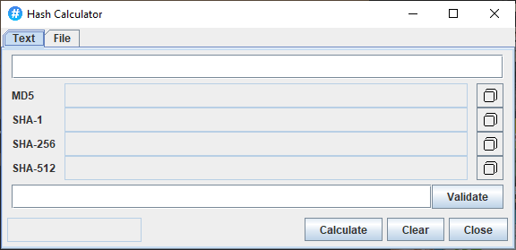

# Hashing Calculator
The Hashing Calculator can output message digests for texts and files. You can validate message digests and can detect which is the correct message digest algorithm.
## Screenshot

